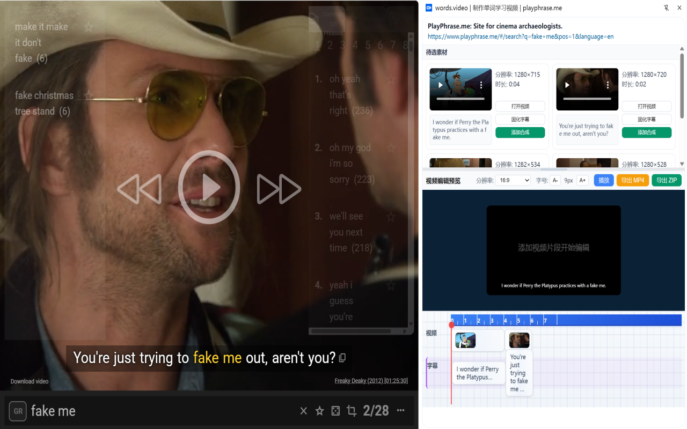
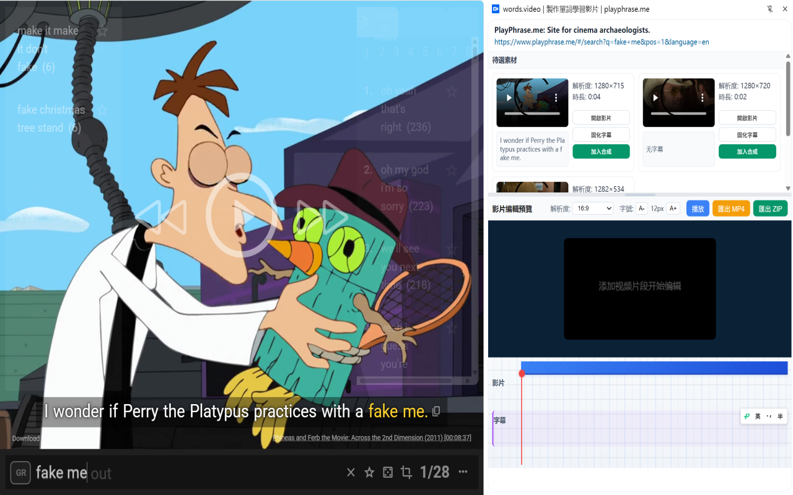

# PlayPhrase.me Chrome Plugin

## Overview

**English**  
A free helper extension to concatenate multiple short videos from [PlayPhrase.me](https://playphrase.me/) into one video, with subtitles.  
Easily create composite videos for language learning or entertainment!  
Thanks to [PlayPhrase.me](https://playphrase.me/) for providing the video resources.

**中文**  
一个免费的 Chrome 插件，可以将来自 [PlayPhrase.me](https://playphrase.me/) 的多个短视频拼接成一个视频，并自动生成字幕。  
轻松制作适用于语言学习或娱乐的合成视频！  
感谢 [PlayPhrase.me](https://playphrase.me/) 提供视频资源。

**日本語**  
[PlayPhrase.me](https://playphrase.me/) から複数の短い動画を字幕付きで一つの動画に結合できる無料の Chrome 拡張機能です。  
語学学習やエンターテインメントに最適な合成動画を作成できます！  
動画提供元の [PlayPhrase.me](https://playphrase.me/) に感謝します。

---

## Features / 功能 / 特徴

- **Concatenate multiple short videos**  
  Easily select and merge phrases into one video.

- **Automatic subtitle generation**  
  Generates subtitles for the resulting video based on the original phrases.

- **Multi-language UI**  
  Supports English, Chinese, and Japanese interface.

- **Lightweight and free**  
  No registration required, no ads.

---

## Installation / 安装方法 / インストール方法

1. Download the latest release ZIP from [dist](./dist).
2. Unzip and go to `chrome://extensions/`.
3. Enable "Developer mode".
4. Click "Load unpacked" and select the unzipped folder.
5. Start using the extension on [PlayPhrase.me](https://playphrase.me/)!

---

## Usage / 使用方法 / 使い方

1. Go to [PlayPhrase.me](https://playphrase.me/).
2. Use the plugin to select phrases/videos you want to concatenate.
3. Click the "Concat" button to generate a single video with all selected phrases and subtitles.
4. Download the final video from the plugin interface.

---

## Screenshots / 截图 / スクリーンショット

---

## Credit

- Thanks to [PlayPhrase.me](https://playphrase.me/) for their awesome resource.

---

## License / 许可证 / ライセンス

MIT
